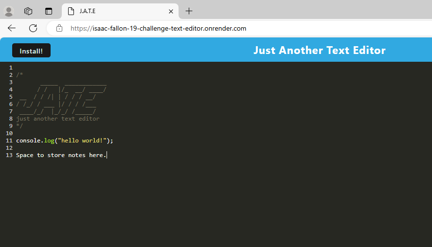

# 19-Challenge-Text-Editor

        
## Description

This project is a text editor Progressive Web Application (PWA) built using the Indexed Database API Javascript interface and deployed at a live website via Render.

I built this application as a way to create notes that can be viewed either online or offline if the application is downloaded as a PWA. 

By completing this project, I have a better understanding of how PWA's are utilised to provide functionality either with or without an internet connection. 

### Screenshot of the deployed application with some stored text:

            
## Table of Contents
            
- [Installation](#installation)
- [Usage](#usage)
- [License](#license)
- [Contributing](#contributing)
- [Tests](#tests)
- [Questions](#questions)
            
## Installation

There is no installation required if you want to access the deployed application via Render which is available here: https://isaac-fallon-19-challenge-text-editor.onrender.com/

However, if you'd prefer to run the program locally, you can do so by following these steps:

1. Clone the repository to your local machine. [Refer to this guide from GitHub if you need help.](https://docs.github.com/en/repositories/creating-and-managing-repositories/cloning-a-repository/)

2. Once cloned, you will need to navigate to the project's folder in your terminal and run the following command to install the necessary dependencies: `npm install`.

3. While still in the project's folder in your terminal, enter the command: `npm run start:dev` to run the application locally.

4. In your browser of choice, navigate to the following URL: `http://localhost:8080/` which should show the locally deployed application. 
            
## Usage

To use the deployed application, visit the link hosted on Render here:
https://isaac-fallon-19-challenge-text-editor.onrender.com/

If you would like to use the application locally, please follow the steps outlined in the [installation](#installation) section. 

## License
            
MIT License

Copyright (c) 2024 isaacfallon
            
Permission is hereby granted, free of charge, to any person obtaining a copy
of this software and associated documentation files (the "Software"), to deal
in the Software without restriction, including without limitation the rights
to use, copy, modify, merge, publish, distribute, sublicense, and/or sell
copies of the Software, and to permit persons to whom the Software is
furnished to do so, subject to the following conditions:
            
The above copyright notice and this permission notice shall be included in all
copies or substantial portions of the Software.
            
THE SOFTWARE IS PROVIDED "AS IS", WITHOUT WARRANTY OF ANY KIND, EXPRESS OR
IMPLIED, INCLUDING BUT NOT LIMITED TO THE WARRANTIES OF MERCHANTABILITY,
FITNESS FOR A PARTICULAR PURPOSE AND NONINFRINGEMENT. IN NO EVENT SHALL THE
AUTHORS OR COPYRIGHT HOLDERS BE LIABLE FOR ANY CLAIM, DAMAGES OR OTHER
LIABILITY, WHETHER IN AN ACTION OF CONTRACT, TORT OR OTHERWISE, ARISING FROM,
OUT OF OR IN CONNECTION WITH THE SOFTWARE OR THE USE OR OTHER DEALINGS IN THE
SOFTWARE.
            
## Contributing

N/A
            
## Tests

N/A
     
## Questions
            
If you have any questions, please reach out at either of the following:
            
### GitHub profile:
- https://github.com/isaacfallon

### Email:
- isaac.fallon@gmail.com